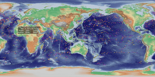

# argo-vis
Repository for visualising Argo float deployments through time in video

This application runs in docker to generate mp4 video animations from [argo](http://www.argo.ucsd.edu/) data 1998-now

The Marine Institute specific use case is to display the data on a [Pufferfish display](https://pufferfishdisplays.com/)



Full videos can be [downloaded here](http://spiddal.marine.ie/argos/).

# Installing

```shell
git clone https://github.com/IrishMarineInstitute/argo-vis.git
cd argo-vis
docker build -t timecut .
```

# Running
```
bin/argoanim.sh
```

If it all works, you will find the mp4 videos in the output folder.
